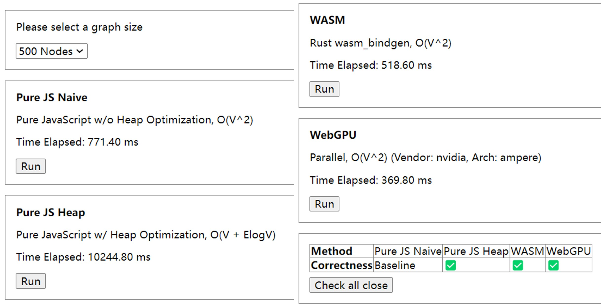

# dijkstra-manyjs

Compare Dijkstra Shortest Path algorithm by different JavaScript approaches (Vanilla, WASM, WebGPU).

Please visit [z0gsh1u.github.io/dijkstra-manyjs/](z0gsh1u.github.io/dijkstra-manyjs/) to run.

Graphs are from [Emilylulu/parallel-Dijkstra-s-Algorithm](https://github.com/Emilylulu/parallel-Dijkstra-s-Algorithm/tree/master/data).

